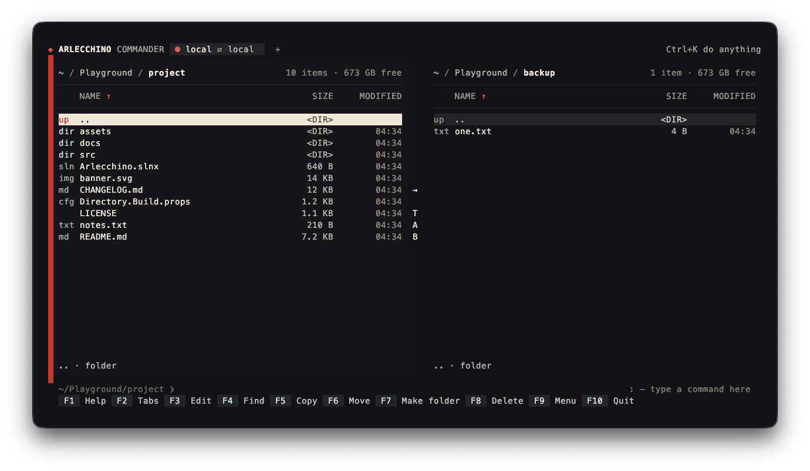
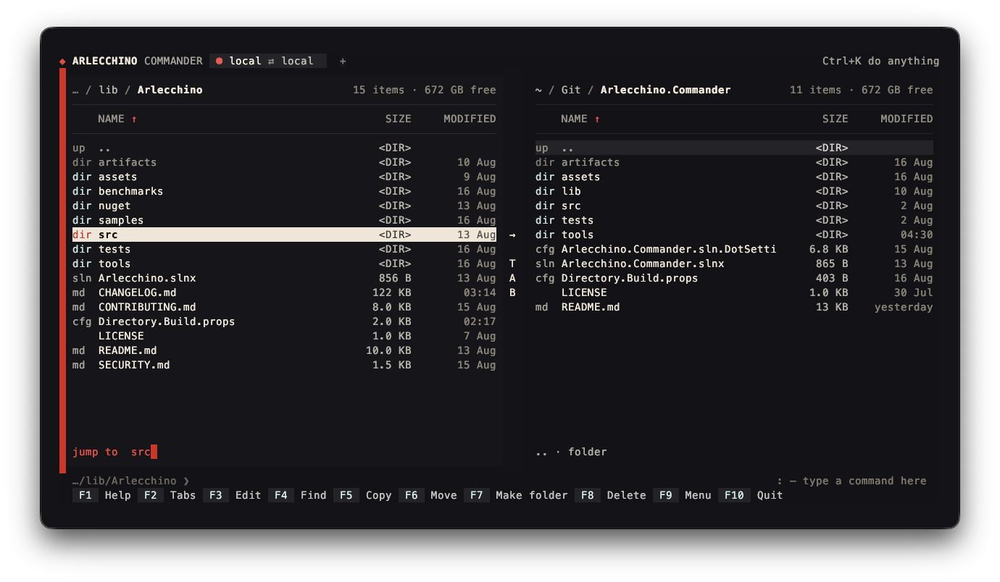
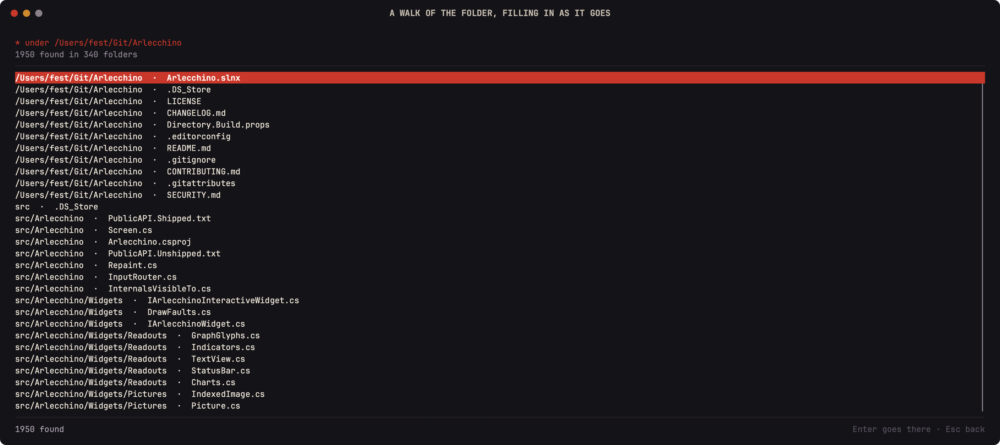
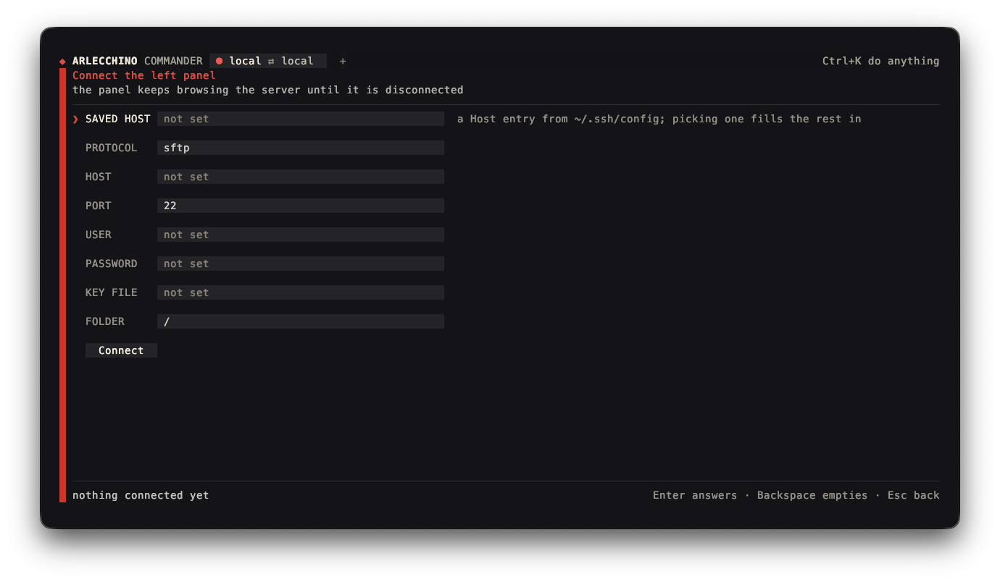
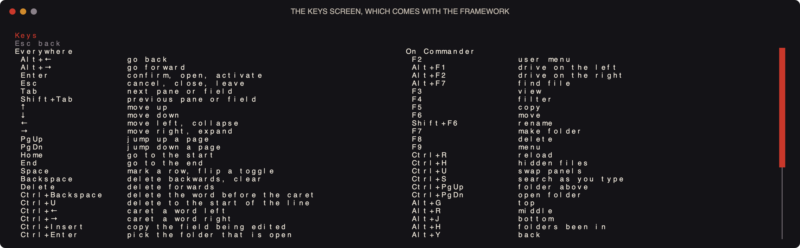

<p align="center">
  
</p>

<p align="center">
  <a href="https://github.com/The1fEst/Arlecchino.Commander/releases/latest"></a>
  <a href="https://github.com/The1fEst/Arlecchino.Commander/releases"></a>
  <a href="https://github.com/The1fEst/Arlecchino.Commander/actions/workflows/build.yml"></a>
  
  <a href="https://github.com/The1fEst/Arlecchino"></a>
  <a href="LICENSE"></a>
</p>

A file manager for the terminal, written on [Arlecchino](https://github.com/The1fEst/Arlecchino): two
panels over a local disk, an SFTP server or an FTP one, with tabs, leader keys and a command line of
its own. The function keys stay where they have always been, but little else stops there.

```
dotnet run --project src/Arlecchino.Commander -- C:\some\folder C:\another
```



<details>
<summary><b>More screens</b> — panels, marks, the menu, operations, finding, servers, SSH, notifications</summary>












</details>

## Getting it

Every tag builds a native binary for Windows, macOS and Linux on both architectures, compiled ahead
of time — one file, nothing to install, no .NET on the machine required. They are on the
[releases page](https://github.com/The1fEst/Arlecchino.Commander/releases). A version is the year,
the month and which release of that month it is, so `2026.8.1` is the first release of August 2026
and the number says how old the binary in hand is.

## What it does

- **Two panels.** `Tab` switches between them, `Enter` opens, `Space` marks. The panel that has the focus
  is the one the operations work from. The cursor moves on `j` and `k` as well as the arrows, and `h` and
  `l` — `←` and `→` too — leave the folder and enter the one under the cursor, which is where those keys
  are worth more than on swapping panels.
- **Sorting, behind `s`.** `s h` `s j` `s k` order the panel by name, size or date, and `s l` turns the
  order around whichever column it is on. A click on a column head does the same.
- **The function keys.** `F2` tabs, `F3` view, `F4` edit, `F5` copy, `F6` move, `Shift+F6` rename,
  `F7` make folder, `F8` delete, `F9` menu, `F10` quit — and `F1` lists every key at once, what the
  framework answers to everywhere beside what the panels bound for themselves.
- **Tabs.** Each one holds two panels of its own, so a second pair of folders — or a server on one
  side — is a tab away rather than a place you have to navigate back to. They live behind `t`: `t k` opens
  one and `t j` closes it, `t h` and `t l` step between them, and `t o` lists them all. The band along the
  top shows what each one is connected to and takes a click on it, on its `×`, or on the `+` at the end. Too many tabs for the
  band shortens the names first and then scrolls, with `‹` and `›` for the ones off either side; going to
  a tab always brings it back into view. `F2` lists them too, and the palette finds a tab by name —
  typing the name of a server goes to the tab that is on it.
- **Going somewhere, behind `g`.** A leader spends one key and gives back the alphabet: `g h` and `g l`
  walk back and forward through the folders the panel has been in. `g u` `g o`
  `g m` jump to the top, the middle and the bottom of the panel, `g b` sends the other panel here and
  `g y` sends it into the folder under the cursor. Which way a key goes is where it sits rather than what
  it stands for. Once the leader is pressed, the keys that finish it are listed over the command line, in
  the shape the settings use to offer their own words, so nothing here has to be remembered. Nothing needs
  a key a laptop does not have: where `Ctrl+PgUp` and `Ctrl+PgDn` read well they still leave and enter a
  folder, but only as a second way in.
- **Getting around the way Midnight Commander does.** `/` searches as you type, jumping to the name as
  it is typed, `+` and `-` mark and unmark by shell pattern, and `*` inverts the marks.
- **Find file.** `Ctrl+F7` asks for a name and walks down from the panel — over SFTP as readily as
  over a disk. What is typed is looked for anywhere in a name, unless it spells a shell pattern of its
  own. Results fill in while the walk runs, `F3` stops it, and `Enter` sends the panel to the file it
  found.
- **Everything in one list.** `Ctrl+K` opens a palette holding every menu entry, every tab and every
  key the screen answers to, narrowing as you type — so nothing has to be found by remembering which
  menu it was filed under.
- **Doing something to what is on the panel, behind `x`.** `x c` sets permissions — through SFTP's own
  request, FTP's `SITE CHMOD`, or the file mode on a Unix disk — `x o` hands a `chown` to the shell where
  the panel is looking, `x s` and `x l` make a symbolic or a hard link into the other panel, `x d` marks
  in both panels every file the other one does not have the same of, `x i` shows the invisible files, and
  `x r` reads both panels again.
- **The clipboard, behind `c`.** `c c` puts the marked paths on it, whole and one to a line, `c f` the
  names with their extensions, `c n` the names without them, and `c d` the folder the panel is looking at.
  None of it is what a selection dragged over the panel would give you: the panel draws names cut to the
  width of a column, and what is copied is what the file is called. It is a leader rather than a modifier
  because every modifier worth reaching for belongs to the terminal — `Ctrl+Shift+C` is the terminal's own
  copying and never arrives, and `Ctrl+C` stops things. What is copied goes out through the terminal as
  OSC 52 and through `wl-copy`, `xclip` or whichever of their kind is installed, since a terminal with the
  sequence switched off drops it without a word.
- **Panels that keep up by themselves.** A file made, written or deleted by something else — another
  window, a build, a download — turns up in the panel with no key pressed. On a disk the operating system
  says so; on a server, which says nothing, the folder on screen is read again every few seconds and
  compared with what the panel has, and nothing is asked of it while it is carrying files. The panels of a
  tab that is not on screen stop watching until it is come back to, and `watch off` stops all of it.
- **A real editor on `F4`.** There is no editor of our own: the terminal is handed to the one the
  settings name — the screen steps aside, the editor gets the keyboard and the screen to itself, and the
  panel is read again when it exits. Files on this machine only; a panel showing a server says so.
- **Settings, behind `!`.** The same row the command line uses, opened by an exclamation mark, with a box
  above it listing what can be set, what each of them is now and what it is for — narrowing as you type,
  `Tab` finishing the word, and a name on its own filling in its current value so it can be edited rather
  than retyped. `editor vim` keeps the editor, and `watch 5` how often a server is read again. What is
  kept lives in `~/.config/arlecchino.commander/settings.toml` (or under `XDG_CONFIG_HOME`), written the moment
  something changes rather than on the way out — a file manager is quit by closing the terminal as often
  as by pressing the key for it. With nothing set, `$VISUAL` and `$EDITOR` are what the editor already is.
- **A command line under the panels, behind `:`.** The panel keeps the letters until the colon asks for
  them, which is what leaves a key free to be a key. `Enter` runs what was typed where the panel is
  looking — on the server itself when that panel is connected — `Escape` gives the keyboard back, `cd`
  moves the panel instead of a shell that would forget it, `Ctrl+P` and `Ctrl+Y` walk the history,
  `x n` puts the name under the cursor on the line, `x p` the folder, `x t` the marked names, and
  `Ctrl+O` reads back everything the commands printed.
- **Commands that ask something back.** What a command prints arrives as it prints it, and its input is
  left open, so a command that stops mid-line on a question is answered rather than waited on. The
  question opens as a dialog wherever in the application you are, and the dialog is the only way to
  answer it: what is typed there is hidden as it is typed, and nothing of it reaches the command line,
  which goes on being for commands. `x a` brings the question back where the dialog was closed on it.
  Where there is no terminal to be had — on a server, on a machine that has no such thing — `sudo` is
  spelled `sudo -S` on the way out, since otherwise it looks for one and gives up before it has asked.
  `x d` says there is no more input, as `Ctrl+D` does at a terminal. Nothing answered is written into the
  roll: what went is shown as dots.
- **Commands that want the screen.** A command runs at a terminal of the application's own making rather
  than on a pipe, and what it does with that terminal is watched. Nothing is guessed from the name it was
  typed under — a list of the names of editors is a list that is always one program short. A program that
  means to draw says so itself in the first thing it writes: it swaps onto the second screen a terminal
  keeps, or turns the mouse on, or asks the keyboard for the arrows, or simply puts the cursor where it
  wants it. At that moment the screen steps aside exactly as it does for the editor on `F4`, the program
  has the keyboard and the terminal to itself, and the panels come back when it ends. An editor typed on
  the command line, a pager, a list of processes, a box a package manager puts up: all of them work, and
  none of them are known about. Everything else goes on as it was — the lines land in the roll, and a
  question opens a dialog.
- **Servers.** A panel connects over SFTP or FTP and browses it exactly as it browses a disk; copying
  between the two panels is the same key whichever side is which.
- **Hosts from `~/.ssh/config`.** `g n` lists the `Host` entries and opens one, reusing its
  `HostName`, `User`, `Port` and `IdentityFile`, or the default keys in `~/.ssh` when it names none.
- **Commands over SSH.** The `Command` menu runs one on the connected host and shows what it said.
- **Work that does not freeze the screen.** Copy, move and delete run in the background with a bar,
  the file being worked on, and `Ctrl+X Esc` to stop; each reports itself as a notification that turns into
  what came of it, with the errors readable in full behind `Enter`.

## Reading a frame without a terminal

The application renders one frame and exits, which is what the screenshots and the CI check are made
of:

```
dotnet run --project src/Arlecchino.Commander -- --frame 120x30 --left . --right src
```

`--keys F9,Enter` plays keys before the frame is drawn, `--connect sftp://user@host/path?key=…` (or
`--connect myhost` for a `~/.ssh/config` entry) opens a panel on a server first, and `--wait 2000`
gives the network time to answer.

## Building

The framework is a submodule under `lib/Arlecchino`, and nothing compiles without it:

```
git clone --recurse-submodules https://github.com/The1fEst/Arlecchino.Commander.git
```

A clone that already exists picks it up with `git submodule update --init`. After that:

```
dotnet build Arlecchino.Commander.slnx --configuration Release
```

The framework builds from source with the application, so a change made in `lib/Arlecchino` is in the
next build. Moving to a newer framework is `git -C lib/Arlecchino pull` and a commit of the new
revision here.

The screenshots are taken by `tools/shots.cs`, which draws each frame itself onto a window of its own
making. Every scene is taken unless some are named:

```
dotnet run tools/shots.cs viewer connect help
```

`show` walks the same scenes in this terminal instead, one key apart, so a frame can be read as the
terminal draws it. `shoot` walks them on its own and has macOS photograph the window each frame is
drawn in — the real font and the shadow the system puts under a window — into `assets/screenshots`,
which is where the pictures above come from; `q` between two pictures stops it. Both take the names of
scenes as well. It wants kitty with remote control on, since that is what names the window to capture,
and the first run asks for permission to record the screen:

```
dotnet run tools/shots.cs shoot viewer connect help
```

`tape` records the animation this README opens with, and it is photographed the same way:
one run of the application plays the whole script and hands back every frame with the milliseconds it
is to be held for, then each frame is written to this window and captured. ffmpeg binds them into an
APNG — every color the terminal drew and the shadow under the window, neither of which fits in a GIF's
256 — and a frame wider than 1400 pixels is scaled down to that, so the file stays the size a README
can carry. It wants ffmpeg on the path, and a window around 120 columns reads best:

```
dotnet run tools/shots.cs tape
```

## License

MIT.
