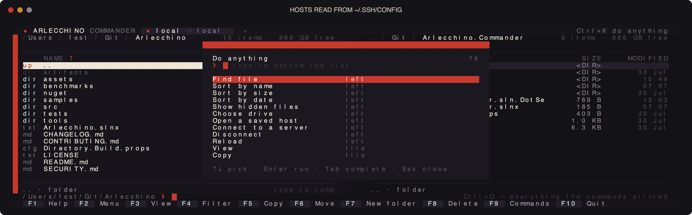

# Arlecchino.Commander

A Midnight Commander for the terminal, written on [Arlecchino](https://github.com/The1fEst/Arlecchino):
two panels, the function keys where they have always been, and the same panel over a local disk, an
SFTP server or an FTP one.

```
dotnet run --project src/Arlecchino.Commander -- C:\some\folder C:\another
```


<details>
<summary><b>More screens</b> — marks, the menu, operations, servers, SSH, notifications</summary>





</details>

## Getting it

Every tag builds a native binary for Windows, macOS and Linux on both architectures, compiled ahead
of time — one file, nothing to install, no .NET on the machine required. They are on the
[releases page](https://github.com/The1fEst/Arlecchino.Commander/releases).

## What it does

- **Two panels.** `Tab` switches, `Enter` opens, `Backspace` goes up, `Space` marks, and the columns
  sort by name, size or date. The panel that has the focus is the one the operations work from.
- **The function keys.** `F3` view, `F4` filter, `F5` copy, `F6` move, `Shift+F6` rename, `F7` make
  folder, `F8` delete, `F9` menu, `F10` quit — and `F1` opens the framework's own key screen.
- **Getting around the way Midnight Commander does.** `Ctrl+S` searches as you type, `+` and `-` mark
  and unmark by shell pattern, `*` inverts the marks, `Alt+G` `Alt+R` `Alt+J` jump to the top, the
  middle and the bottom, `Ctrl+PgUp` and `Ctrl+PgDn` leave and enter a folder, `Alt+H` lists the
  folders the panel has been in with `Alt+Y` and `Alt+U` stepping through them, `Ctrl+B` keeps a
  hotlist, `Alt+I` sends the other panel here and `Alt+O` sends it into the folder under the cursor.
- **Find file.** `Alt+F7` walks down from the panel — over SFTP as readily as over a disk — matching
  names against a shell pattern and, when asked for one, the text inside the files. Results fill in
  while the walk runs, `F3` stops it, and `Enter` sends the panel to the file it found.
- **A user menu on `F2`.** Kept in `~/.config/arlecchino-commander/menu` in the shape Midnight
  Commander keeps one: a title in the first column, the commands under it indented, and `%f` `%t`
  `%d` `%F` `%D` standing in for the file, the marked files, this folder and the other panel's. The
  first `F2` writes a menu to start from.
- **The operations behind `Ctrl+X`.** `Ctrl+X C` sets permissions — through SFTP's own request, FTP's
  `SITE CHMOD`, or the file mode on a Unix disk — `Ctrl+X O` hands a `chown` to the shell where the
  panel is looking, `Ctrl+X S` and `Ctrl+X L` make a symbolic or a hard link into the other panel,
  and `Ctrl+X D` marks in both panels every file the other one does not have the same of.
- **A command line under the panels.** Typing goes to it while the panel keeps the cursor, `Enter`
  runs it where the panel is looking — on the server itself when that panel is connected — `cd` moves
  the panel instead of a shell that would forget it, `Alt+P` and `Alt+N` walk the history, `Alt+Enter`
  puts the name under the cursor on the line, `Ctrl+X P` the path, `Ctrl+X T` the marked names, and
  `Ctrl+O` reads back everything the commands printed.
- **Servers.** A panel connects over SFTP or FTP and browses it exactly as it browses a disk; copying
  between the two panels is the same key whichever side is which.
- **Hosts from `~/.ssh/config`.** `Ctrl+K` lists the `Host` entries and opens one, reusing its
  `HostName`, `User`, `Port` and `IdentityFile`, or the default keys in `~/.ssh` when it names none.
- **Commands over SSH.** The `Command` menu runs one on the connected host and shows what it said.
- **Work that does not freeze the screen.** Copy, move and delete run in the background with a bar,
  the file being worked on, and `Esc` to stop; each reports itself as a notification that turns into
  what came of it, with the errors readable in full behind `Enter`.

## Reading a frame without a terminal

The application renders one frame and exits, which is what the screenshots and the CI check are made
of:

```
dotnet run --project src/Arlecchino.Commander -- --frame 120x30 --left . --right src
```

`--keys F9,Enter` plays keys before the frame is drawn, `--connect sftp://user@host/path?key=…` (or
`--connect myhost` for a `~/.ssh/config` entry) opens a panel on a server first, and `--wait 2000`
gives the network time to answer.

## Building

```
dotnet build Arlecchino.Commander.slnx --configuration Release
```

The screenshots in the framework's README are rendered by `tools/shots.cs`:

```
dotnet run tools/shots.cs
```

## License

MIT.
