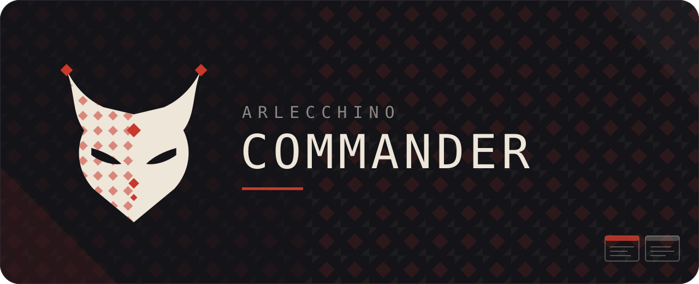
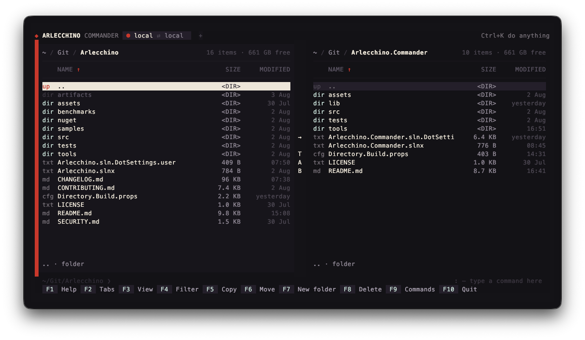
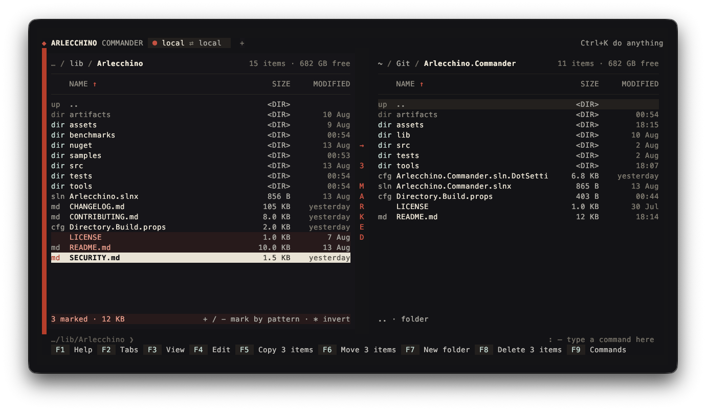
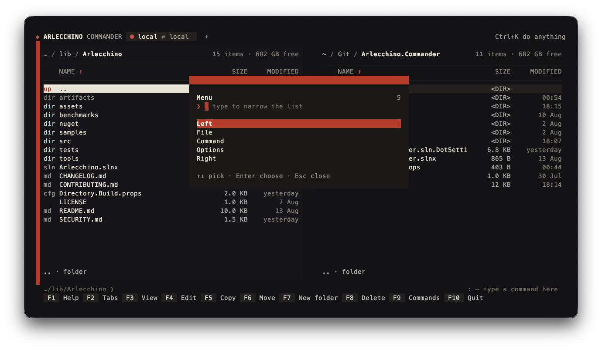
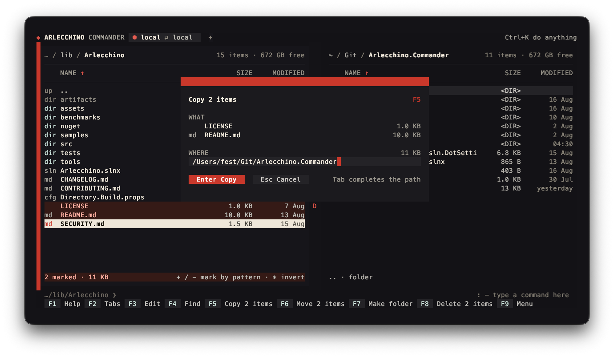
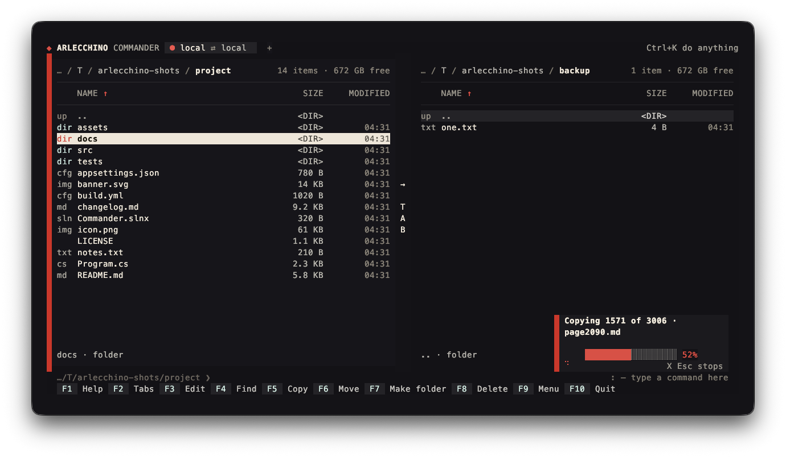
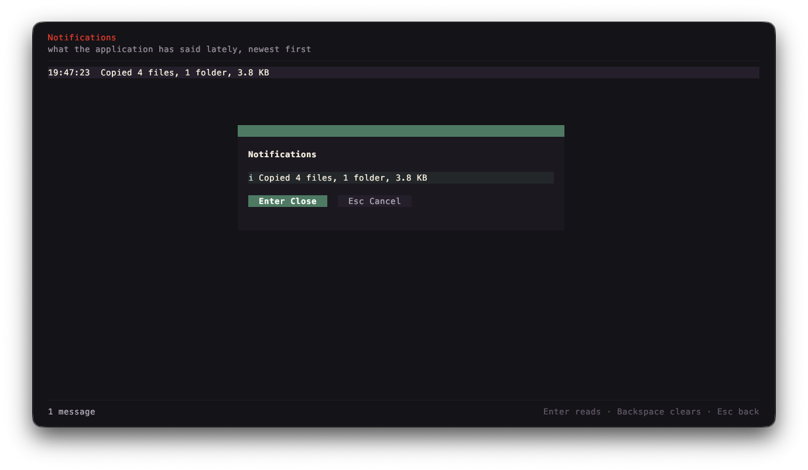
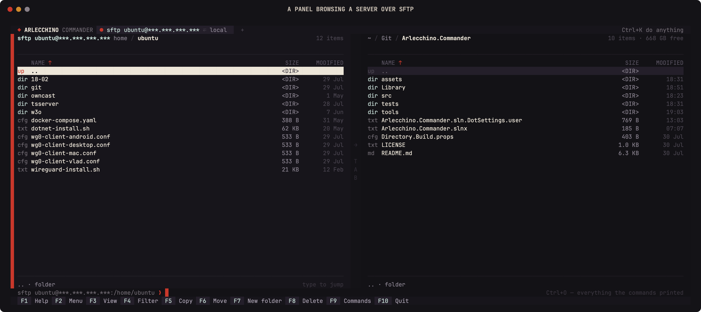
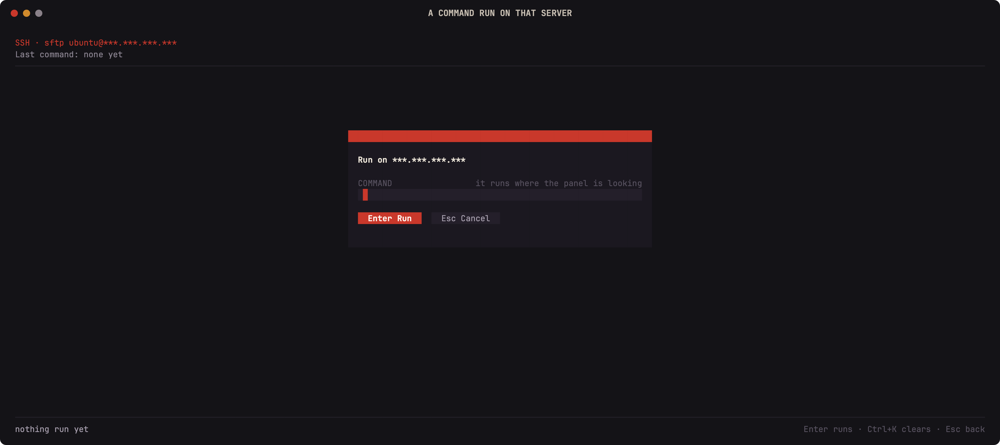
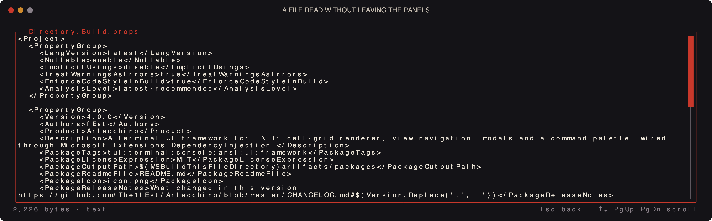

<p align="center">
  
</p>

<p align="center">
  <a href="https://github.com/The1fEst/Arlecchino.Commander/releases/latest"></a>
  <a href="https://github.com/The1fEst/Arlecchino.Commander/releases"></a>
  <a href="https://github.com/The1fEst/Arlecchino.Commander/actions/workflows/build.yml"></a>
  
  <a href="https://github.com/The1fEst/Arlecchino"></a>
  <a href="LICENSE"></a>
</p>

A Midnight Commander for the terminal, written on [Arlecchino](https://github.com/The1fEst/Arlecchino):
two panels, the function keys where they have always been, and the same panel over a local disk, an
SFTP server or an FTP one.

```
dotnet run --project src/Arlecchino.Commander -- C:\some\folder C:\another
```



<details>
<summary><b>More screens</b> — marks, the menu, operations, servers, SSH, notifications</summary>

















</details>

## Getting it

Every tag builds a native binary for Windows, macOS and Linux on both architectures, compiled ahead
of time — one file, nothing to install, no .NET on the machine required. They are on the
[releases page](https://github.com/The1fEst/Arlecchino.Commander/releases).

## What it does

- **Two panels.** `Tab` switches, `Enter` opens, `Backspace` goes up, `Space` marks, and the columns
  sort by name, size or date. The panel that has the focus is the one the operations work from.
- **The function keys.** `F2` tabs, `F3` view, `F4` filter, `F5` copy, `F6` move, `Shift+F6` rename,
  `F7` make folder, `F8` delete, `F9` menu, `F10` quit — and `F1` opens the framework's own key screen.
- **Tabs.** Each one holds two panels of its own, so a second pair of folders — or a server on one
  side — is a tab away rather than a place you have to navigate back to. They live behind `Ctrl+G`, laid
  out under the hand that is not holding Control: `Ctrl+G I` opens one and `Ctrl+G K` closes it,
  `Ctrl+G J` and `Ctrl+G L` step between them, and `Ctrl+G O` lists them all. The band along the top
  shows what each one is connected to and takes a click on it, on its `×`, or on the `+` at the end. Too many tabs for the
  band shortens the names first and then scrolls, with `‹` and `›` for the ones off either side; going to
  a tab always brings it back into view. `F2` lists them too, and the palette finds a tab by name —
  typing the name of a server goes to the tab that is on it.
- **Going somewhere, behind `Ctrl+D`.** A leader spends one key and gives back the alphabet, laid out
  under the hand that is not holding Control: `Ctrl+D I` and `Ctrl+D K` leave and enter a folder,
  `Ctrl+D J` and `Ctrl+D L` walk back and forward through the folders the panel has been in with
  `Ctrl+D P` listing them, `Ctrl+D U` `Ctrl+D O` `Ctrl+D M` jump to the top, the middle and the bottom
  of the panel, `Ctrl+D H` sends the other panel here and `Ctrl+D Y` sends it into the folder under the
  cursor. Opposites face each other, so which way a key goes is where it is rather than what it stands
  for. Once the leader is pressed, the box in the corner lists what finishes it, so nothing here has to
  be remembered. Nothing needs a key a laptop does not have: where `Ctrl+PgUp` and `Ctrl+PgDn` read well
  they still work, but only as a second way in.
- **Getting around the way Midnight Commander does.** `Ctrl+S` searches as you type, `+` and `-` mark
  and unmark by shell pattern, `*` inverts the marks, and `Ctrl+B` keeps a hotlist.
- **Find file.** `Ctrl+F7` walks down from the panel — over SFTP as readily as over a disk — matching
  names against a shell pattern and, when asked for one, the text inside the files. Results fill in
  while the walk runs, `F3` stops it, and `Enter` sends the panel to the file it found.
- **Everything in one list.** `Ctrl+K` opens a palette holding every menu entry, every tab and every
  key the screen answers to, narrowing as you type — so nothing has to be found by remembering which
  menu it was filed under.
- **Doing something to what is on the panel, behind `Ctrl+X`.** `Ctrl+X C` sets permissions — through
  SFTP's own request, FTP's `SITE CHMOD`, or the file mode on a Unix disk — `Ctrl+X O` hands a `chown`
  to the shell where the panel is looking, `Ctrl+X S` and `Ctrl+X L` make a symbolic or a hard link
  into the other panel, `Ctrl+X D` marks in both panels every file the other one does not have the
  same of, `Ctrl+X Y` puts the marked paths on the clipboard, and `Ctrl+X R` reads both panels again.
- **A command line under the panels.** Typing goes to it while the panel keeps the cursor, `Enter`
  runs it where the panel is looking — on the server itself when that panel is connected — `cd` moves
  the panel instead of a shell that would forget it, `Ctrl+P` and `Ctrl+Y` walk the history,
  `Ctrl+Enter` puts the name under the cursor on the line, `Ctrl+X P` the folder, `Ctrl+X T` the
  marked names, and `Ctrl+O` reads back everything the commands printed.
- **Servers.** A panel connects over SFTP or FTP and browses it exactly as it browses a disk; copying
  between the two panels is the same key whichever side is which.
- **Hosts from `~/.ssh/config`.** `Ctrl+D N` lists the `Host` entries and opens one, reusing its
  `HostName`, `User`, `Port` and `IdentityFile`, or the default keys in `~/.ssh` when it names none.
- **Commands over SSH.** The `Command` menu runs one on the connected host and shows what it said.
- **Work that does not freeze the screen.** Copy, move and delete run in the background with a bar,
  the file being worked on, and `Ctrl+X Esc` to stop; each reports itself as a notification that turns into
  what came of it, with the errors readable in full behind `Enter`.

## Reading a frame without a terminal

The application renders one frame and exits, which is what the screenshots and the CI check are made
of:

```
dotnet run --project src/Arlecchino.Commander -- --frame 120x30 --left . --right src
```

`--keys F9,Enter` plays keys before the frame is drawn, `--connect sftp://user@host/path?key=…` (or
`--connect myhost` for a `~/.ssh/config` entry) opens a panel on a server first, and `--wait 2000`
gives the network time to answer.

## Building

The framework is a submodule under `lib/Arlecchino`, and nothing compiles without it:

```
git clone --recurse-submodules https://github.com/The1fEst/Arlecchino.Commander.git
```

A clone that already exists picks it up with `git submodule update --init`. After that:

```
dotnet build Arlecchino.Commander.slnx --configuration Release
```

The framework builds from source with the application, so a change made in `lib/Arlecchino` is in the
next build. Moving to a newer framework is `git -C lib/Arlecchino pull` and a commit of the new
revision here.

The screenshots in the framework's README are rendered by `tools/shots.cs`:

```
dotnet run tools/shots.cs
```

## License

MIT.
